

# 🛡️ دليل استخدام منصة أمان

  <strong>أمان – AMAN Platform</strong> 
  دليل استخدام المنصة للمستخدم

---
## 📑 الفهرس

- [📌 عن هذا الدليل](#-عن-هذا-الدليل)
- [1. نبذة عن منصة أمان](#1-نبذة-عن-منصة-أمان)
- [2. الوصول إلى المنصة](#2-الوصول-إلى-المنصة)
- [3. اختيار اللغة](#3-اختيار-اللغة)
- [4. تسجيل الدخول باستخدام رقم الهاتف](#4-تسجيل-الدخول-باستخدام-رقم-الهاتف)

- [5. البرامج التعليمية](#5-البرامج-التعليمية)
  - [5.1 البحث عن برنامج](#51-البحث-عن-برنامج)
  - [5.2 اختيار البرنامج](#52-اختيار-البرنامج)
  - [5.3 بدء البرنامج](#53-بدء-البرنامج)

- [6. تجربة التعلم التفاعلي](#6-تجربة-التعلم-التفاعلي)
  - [6.1 واجهة الفيديو التفاعلي](#61-واجهة-الفيديو-التفاعلي)
  - [6.2 مشاهدة الفيديو](#62-مشاهدة-الفيديو)
  - [6.3 التنقل بين المشاهد](#63-التنقل-بين-المشاهد)
  - [6.4 الأسئلة التفاعلية](#64-الأسئلة-التفاعلية)
  - [6.5 الإجابة الصحيحة](#65-الإجابة-الصحيحة)
  - [6.6 الإجابة الخاطئة](#66-الإجابة-الخاطئة)
  - [6.7 القلوب والتقدم](#67-القلوب-والتقدم)
  - [6.8 ملء الشاشة والتحكم بالفيديو](#68-ملء-الشاشة-والتحكم-بالفيديو)

- [7. إكمال البرنامج وعرض النتائج](#7-إكمال-البرنامج-وعرض-النتائج)
  - [7.1 مشاركة النتيجة](#71-مشاركة-النتيجة)
  - [7.2 المتابعة للحصول على الشهادة](#72-المتابعة-للحصول-على-الشهادة)

- [8. تقييم تجربة البرنامج](#8-تقييم-تجربة-البرنامج)

- [9. مراجعة وإكمال بيانات الملف الشخصي](#9-مراجعة-وإكمال-بيانات-الملف-الشخصي)

- [10. شهادة الإنجاز](#10-شهادة-الإنجاز)
  - [10.1 تحميل الشهادة بصيغة PDF](#101-تحميل-الشهادة-بصيغة-pdf)
  - [10.2 مشاركة الشهادة](#102-مشاركة-الشهادة)
  - [10.3 إرسال الشهادة إلى البريد الإلكتروني](#103-إرسال-الشهادة-إلى-البريد-الإلكتروني)
  - [10.4 رمز QR Code](#104-رمز-qr-code)
  - [مسار الحصول على الشهادة باختصار](#-مسار-الحصول-على-الشهادة-باختصار)

- [11. التحقق من الشهادة](#11-التحقق-من-الشهادة)
  - [11.1 البحث باستخدام رقم الشهادة](#111-البحث-باستخدام-رقم-الشهادة)
  - [11.2 عرض تفاصيل الشهادة](#112-عرض-تفاصيل-الشهادة)

- [12. الملف الشخصي](#12-الملف-الشخصي)
  - [12.1 عرض الملف الشخصي](#121-عرض-الملف-الشخصي)
  - [12.2 تعديل البيانات الشخصية](#122-تعديل-البيانات-الشخصية)
  - [12.3 تغيير اللغة](#123-تغيير-اللغة)
  - [12.4 تسجيل الخروج](#124-تسجيل-الخروج)

- [13. معلومات التوعية](#13-معلومات-التوعية)
  - [13.1 اختيار موضوع التوعية](#131-اختيار-موضوع-التوعية)
  - [13.2 قراءة المحتوى التوعوي](#132-قراءة-المحتوى-التوعوي)

- [14. كن منقذًا](#14-كن-منقذًا)
  - [14.1 مشاهدة القصص المنشورة](#141-مشاهدة-القصص-المنشورة)
  - [14.2 مشاركة قصة جديدة](#142-مشاركة-قصة-جديدة)
  - [14.3 متى تظهر القصة؟](#143-متى-تظهر-القصة)

- [15. عن أمان والصفحات المعلوماتية](#15-عن-أمان-والصفحات-المعلوماتية)
  - [15.1 عن أمان](#151-عن-أمان)
  - [15.2 الأسئلة الشائعة](#152-الأسئلة-الشائعة)
  - [15.3 تواصل معنا](#153-تواصل-معنا)
  - [15.4 المدونة](#154-المدونة)

- [16. المشكلات الشائعة](#16-المشكلات-الشائعة)
  - [16.1 عدم تحميل الفيديو](#161-عدم-تحميل-الفيديو)
  - [16.2 ظهور خطأ أثناء معالجة الإجابة](#162-ظهور-خطأ-أثناء-معالجة-الإجابة)
  - [16.3 عدم ظهور الشهادة](#163-عدم-ظهور-الشهادة)
  - [16.4 عدم العثور على شهادة أثناء التحقق](#164-عدم-العثور-على-شهادة-أثناء-التحقق)
  - [16.5 عدم ظهور القصة بعد إرسالها](#165-عدم-ظهور-القصة-بعد-إرسالها)
  - [16.6 مشكلة في تسجيل الدخول](#166-مشكلة-في-تسجيل-الدخول)

- [17. ملاحظات مهمة](#17-ملاحظات-مهمة)
- [✅ ملخص رحلة المستخدم](#-ملخص-رحلة-المستخدم)
- [📘 نهاية دليل المستخدم](#-نهاية-دليل-المستخدم)
---

## 📌 عن هذا الدليل

يوضح هذا الدليل طريقة استخدام منصة **أمان – AMAN** خطوة بخطوة، بداية من اختيار اللغة وتسجيل الدخول، مرورًا بالبرامج التعليمية والتفاعل مع الفيديوهات والأسئلة، وصولًا إلى النتائج والتقييم والحصول على شهادة الإنجاز.

تم إعداد الدليل بناءً على الواجهات والوظائف المتاحة في النسخة الحالية من المنصة.

---

# 1. نبذة عن منصة أمان

**أمان – AMAN** هي منصة ويب توعوية تفاعلية موجهة للأطفال من عمر **7 إلى 15 عامًا**، وتهدف إلى تقديم مفاهيم السلامة والتوعية بطريقة بسيطة وتفاعلية.

تتيح المنصة للمستخدم:

- مشاهدة برامج وفيديوهات تعليمية تفاعلية.
- الإجابة عن أسئلة تظهر أثناء مشاهدة الفيديو.
- الحصول على تغذية راجعة مباشرة.
- متابعة التقدم والقلوب والإجابات الصحيحة.
- الاطلاع على النتيجة بعد إكمال البرنامج.
- تقييم تجربة البرنامج.
- الحصول على شهادة إنجاز قابلة للتحميل والمشاركة والتحقق.
- قراءة معلومات توعوية مرتبطة بموضوعات البرامج.
- قراءة قصص وتجارب الأطفال ومشاركة قصة جديدة.

---

# 2. الوصول إلى المنصة

تعمل منصة أمان مباشرة من خلال **متصفح الويب**، ولا يحتاج المستخدم إلى تثبيت أي برنامج أو تطبيق.

### رابط المنصة

[فتح منصة أمان](https://aman.76.13.250.92.nip.io/)

### متطلبات الاستخدام

- جهاز كمبيوتر أو هاتف ذكي.
- متصفح ويب حديث.
- اتصال بالإنترنت.
- يفضل استخدام اتصال مستقر أثناء مشاهدة الفيديوهات التعليمية.

> 💡 يمكن استخدام المنصة باللغة العربية أو الإنجليزية.

---

# 3. اختيار اللغة

عند الدخول إلى منصة أمان لأول مرة تظهر شاشة **اختر اللغة**.

تدعم المنصة:

- **العربية**
- **English**

### خطوات اختيار اللغة

1. افتح منصة أمان.
2. ستظهر نافذة **اختر اللغة**.
3. اختر **العربية** أو **English**.
4. اضغط على زر **التالي**.
5. سيتم الانتقال إلى شاشة تسجيل الدخول باللغة المختارة.

### 🖼️ صورة توضيحية

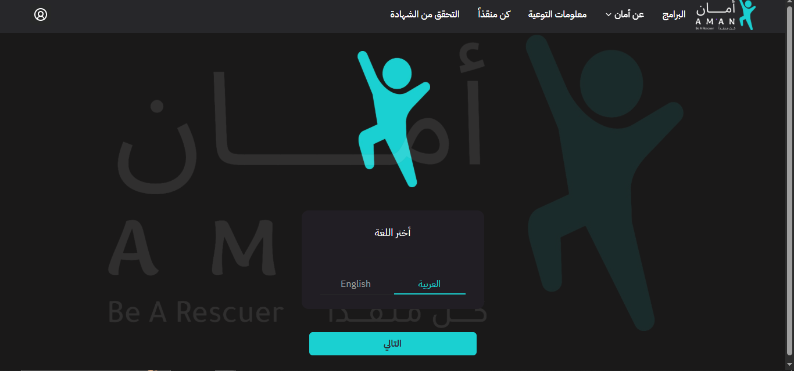

---

# 4. تسجيل الدخول باستخدام رقم الهاتف

بعد اختيار اللغة تظهر صفحة **متابعة تسجيل الدخول**.

يستخدم رقم الهاتف للدخول إلى حساب المستخدم ومتابعة تجربته داخل المنصة.

### خطوات تسجيل الدخول

1. أدخل **رقم الهاتف المحمول** في الحقل المخصص.
2. اختر مفتاح الدولة المناسب عند الحاجة.
3. اضغط على زر **متابعة**.
4. بعد نجاح تسجيل الدخول سيتم نقلك مباشرة إلى صفحة **البرامج التعليمية**.

> ℹ️ **ملاحظة:** لا تظهر في النسخة الحالية شاشة تحقق من رقم الهاتف وارسال رمز التحقق.

### 🖼️ صورة توضيحية

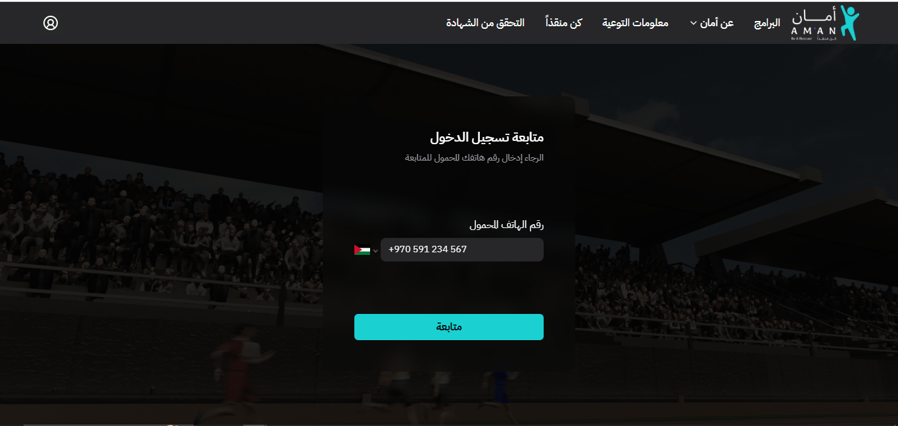

---

## ✅ ماذا يحدث بعد تسجيل الدخول؟

بعد تسجيل الدخول بنجاح ينتقل المستخدم مباشرة إلى صفحة **البرامج**، حيث يمكنه استعراض البرامج التعليمية المتاحة واختيار البرنامج الذي يريد البدء به.

لا توجد صفحة رئيسية منفصلة بين تسجيل الدخول وصفحة البرامج.

---
# 5. البرامج التعليمية

بعد تسجيل الدخول ينتقل المستخدم مباشرة إلى صفحة **البرامج**، وهي الصفحة الرئيسية لبدء تجربة التعلم في منصة أمان.

تعرض الصفحة البرامج التعليمية المتاحة، ويمكن للمستخدم البحث عن برنامج أو اختيار أحد البرامج الظاهرة.

### ما الذي يظهر في صفحة البرامج؟

- البرامج التعليمية المتاحة.
- صورة وعنوان كل برنامج.
- وصف مختصر للبرنامج.
- مدة البرنامج.
- مربع البحث.
- خيار تصفية البرامج.
- زر **بدء البرنامج** عند اختيار البرنامج.

### 🖼️ صورة توضيحية

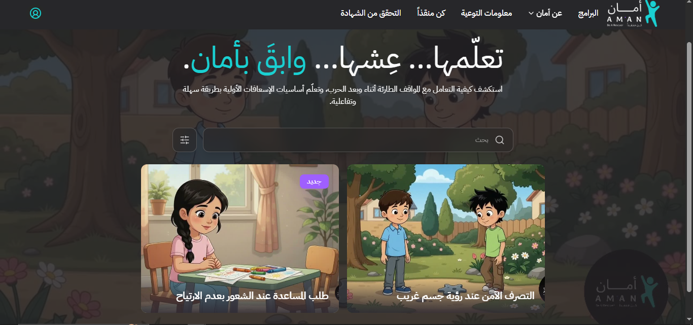

---

## 5.1 البحث عن برنامج

يمكن استخدام مربع البحث للوصول إلى برنامج معين بسرعة.

### الخطوات

1. انتقل إلى صفحة **البرامج**.
2. اضغط على مربع البحث.
3. اكتب اسم البرنامج أو كلمة مرتبطة به.
4. استعرض النتائج الظاهرة.
5. اختر البرنامج الذي ترغب في البدء به.

> 💡 يمكن أيضًا استخدام زر التصفية الموجود بجانب مربع البحث لتسهيل استعراض البرامج.

---

## 5.2 اختيار البرنامج

لاختيار برنامج تعليمي:

1. استعرض البرامج المتاحة.
2. اضغط على بطاقة البرنامج الذي تريد تعلمه.
3. ستظهر معلومات إضافية عن البرنامج، مثل الوصف والمدة.
4. اضغط على زر **بدء البرنامج**.

### 🖼️ صورة توضيحية

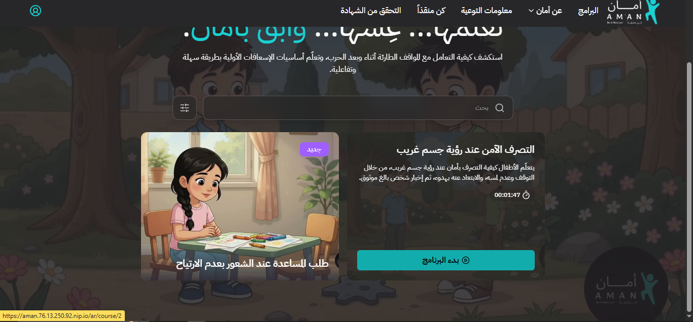

---

## 5.3 بدء البرنامج

بعد الضغط على **بدء البرنامج** يتم الانتقال إلى واجهة الفيديو التفاعلي.

قبل بدء المشاهدة قد تظهر مجموعة من الإرشادات القصيرة التي تساعد المستخدم على التعرف على بعض وظائف البرنامج.

يمكن للمستخدم:

- الضغط على **التالي** للانتقال بين الإرشادات.
- الضغط على **تخطي** لتجاوزها والبدء مباشرة.

من أمثلة الإرشادات التي تظهر:

- متابعة التقدم أثناء مشاهدة الفيديو.
- إمكانية مشاركة النتائج بعد إكمال البرنامج.

### 🖼️ صورة توضيحية

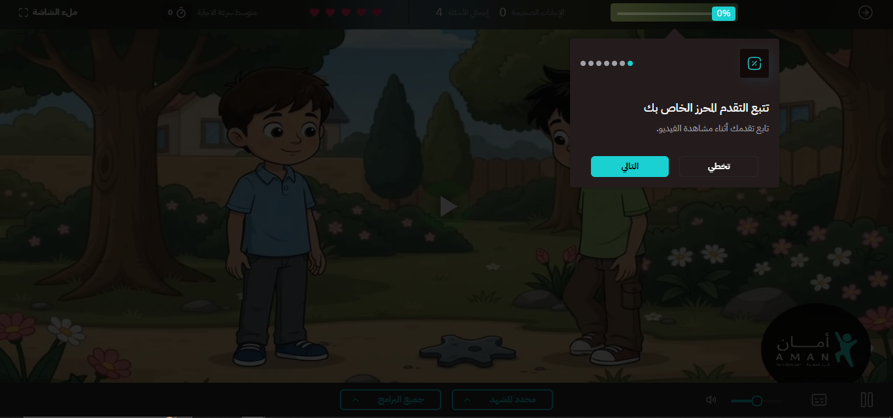

---

# 6. تجربة التعلم التفاعلي

تعتمد تجربة التعلم في منصة أمان على مشاهدة فيديو تعليمي يتوقف تلقائيًا عند نقاط محددة لعرض أسئلة تفاعلية.

خلال البرنامج يستطيع المستخدم متابعة تقدمه، وعدد الإجابات الصحيحة، والقلوب، ومتوسط سرعة الإجابة.

---

## 6.1 واجهة الفيديو التفاعلي

بعد بدء البرنامج تظهر واجهة الفيديو التعليمية.

تحتوي الواجهة على مجموعة من الأدوات والمعلومات التي تساعد المستخدم أثناء التعلم، ومنها:

- **شريط التقدم** في أعلى الصفحة.
- **إجمالي الأسئلة** الموجودة في البرنامج.
- **عدد الإجابات الصحيحة**.
- **القلوب** المتبقية.
- **متوسط سرعة الإجابة**.
- خيار **ملء الشاشة**.
- التحكم في تشغيل الفيديو والصوت.
- **محدد المشهد**.
- قائمة **جميع البرامج**.

### 🖼️ صورة توضيحية

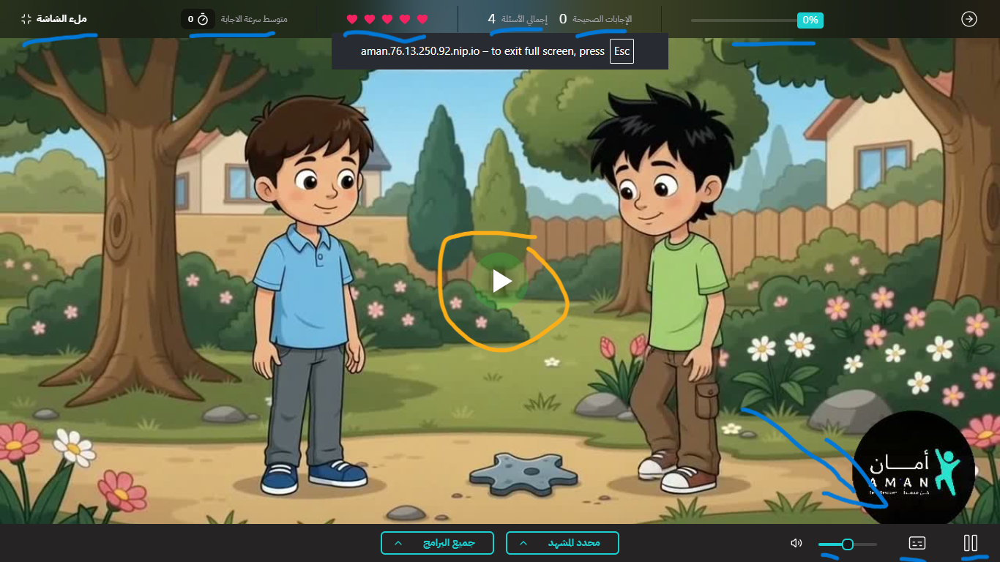

---

## 6.2 مشاهدة الفيديو

لبدء التعلم:

1. اضغط على زر التشغيل الموجود في منتصف الفيديو.
2. شاهد السيناريو التعليمي.
3. تابع شريط التقدم أثناء المشاهدة.
4. عند الوصول إلى نقطة سؤال، يتوقف الفيديو تلقائيًا.
5. يظهر السؤال وخيارات الإجابة على الشاشة.

> 💡 لا يحتاج المستخدم إلى إيقاف الفيديو يدويًا عند الأسئلة؛ يتم إيقافه تلقائيًا عند نقطة السؤال.

---

## 6.3 التنقل بين المشاهد

تحتوي واجهة البرنامج على خيار **محدد المشهد**.

يساعد هذا الخيار المستخدم على التعرف على أجزاء أو مشاهد البرنامج والتنقل بينها عندما يكون ذلك متاحًا.

كما يمكن استخدام خيار **جميع البرامج** للعودة إلى قائمة البرامج التعليمية.

### 🖼️ صورة توضيحية

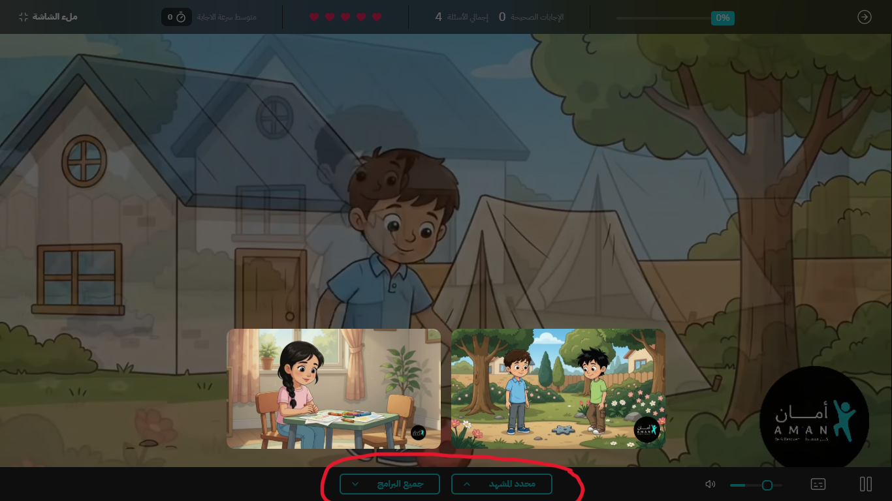

---

## 6.4 الأسئلة التفاعلية

عند وصول الفيديو إلى نقطة سؤال، يتم إيقاف الفيديو وتظهر نافذة تحتوي على:

- نص السؤال.
- مجموعة من الإجابات المحتملة.
- مؤقت زمني للإجابة.

### خطوات الإجابة

1. اقرأ السؤال جيدًا.
2. راجع خيارات الإجابة المتاحة.
3. اختر الإجابة التي تعتقد أنها صحيحة.
4. يقوم النظام بمعالجة الإجابة.
5. تظهر النتيجة مباشرة.
6. بعد ذلك يمكن متابعة الفيديو حتى السؤال التالي.

### 🖼️ صورة توضيحية

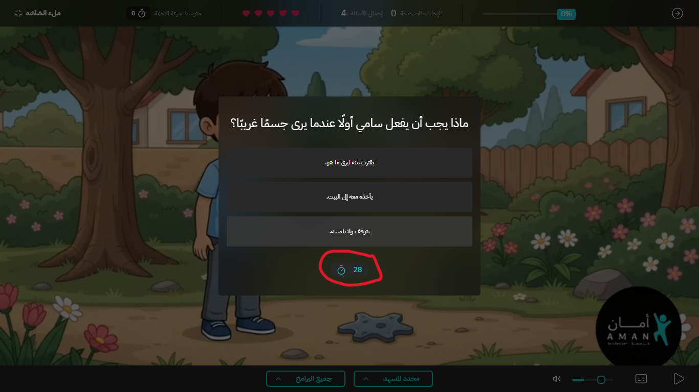

---

## 6.5 الإجابة الصحيحة

عند اختيار الإجابة الصحيحة:

- يتم تمييز الإجابة باللون **الأخضر**.
- يتم تسجيل الإجابة ضمن الإجابات الصحيحة.
- يتم تحديث بيانات التقدم الخاصة بالمستخدم.
- يمكن بعد ذلك متابعة الفيديو.

### 🖼️ صورة توضيحية

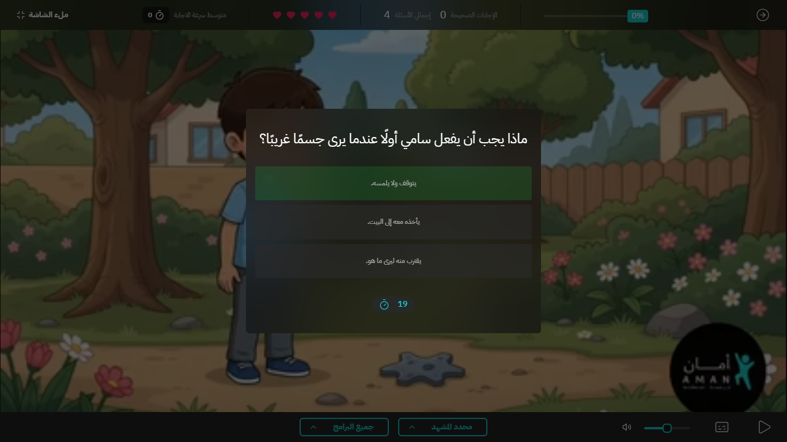

---

## 6.6 الإجابة الخاطئة

عند اختيار إجابة غير صحيحة:

- يتم تمييز الإجابة الخاطئة باللون **الأحمر**.
- يتم تسجيل نتيجة الإجابة.
- قد يتم خصم قلب من عدد القلوب المتاحة.
- يستمر المستخدم في البرنامج بعد ظهور التغذية الراجعة.

### 🖼️ صورة توضيحية

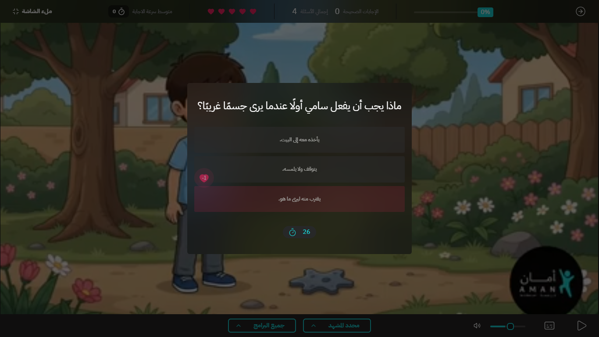

---

## 6.7 القلوب والتقدم

أثناء مشاهدة البرنامج يقوم النظام بتحديث معلومات التعلم بشكل مستمر.

يمكن للمستخدم متابعة:

| العنصر | وظيفته |
|---|---|
| ❤️ القلوب | توضح عدد القلوب المتبقية أثناء تجربة التعلم |
| ✅ الإجابات الصحيحة | عدد الأسئلة التي تمت الإجابة عنها بشكل صحيح |
| ❓ إجمالي الأسئلة | العدد الكلي للأسئلة في البرنامج |
| 📊 التقدم | يوضح نسبة التقدم في البرنامج |
| ⏱️ متوسط سرعة الإجابة | يعرض متوسط الوقت المستغرق للإجابة |

تساعد هذه المعلومات المستخدم على معرفة مستوى تقدمه أثناء البرنامج.

---

## 6.8 ملء الشاشة والتحكم بالفيديو

توفر واجهة البرنامج عددًا من أدوات التحكم، ومنها:

- تشغيل وإيقاف الفيديو.
- التحكم في مستوى الصوت.
- استخدام وضع **ملء الشاشة**.
- عرض أدوات الفيديو المتاحة.
- العودة إلى قائمة البرامج.
- استخدام محدد المشاهد.

> 💡 يمكن استخدام وضع ملء الشاشة للحصول على تجربة مشاهدة أوضح.

---

## ✅ ماذا يحدث بعد الانتهاء من البرنامج؟

بعد مشاهدة الفيديو والإجابة عن الأسئلة والوصول إلى نهاية البرنامج، ينتقل المستخدم إلى صفحة **النتائج**.

تعرض هذه الصفحة نتيجة المستخدم وبعض الإحصاءات المتعلقة بأدائه، ومن هناك يمكنه بدء خطوات الحصول على **شهادة الإنجاز**.

---
# 7. إكمال البرنامج وعرض النتائج

بعد الانتهاء من مشاهدة الفيديو والإجابة عن جميع الأسئلة، يعرض النظام صفحة **النتائج**.

توضح الصفحة أداء المستخدم في البرنامج، وتتيح له مشاركة نتيجته أو المتابعة للحصول على شهادة الإنجاز.

### تعرض صفحة النتائج:

- التقدير النهائي.
- نسبة الإجابات الصحيحة.
- عدد الإجابات الصحيحة من إجمالي الأسئلة.
- متوسط سرعة الإجابة.
- بطاقة لمشاركة النتيجة.
- خيارات مشاركة الإنجاز.
- زر **المتابعة للحصول على الشهادة**.

### 🖼️ صورة توضيحية

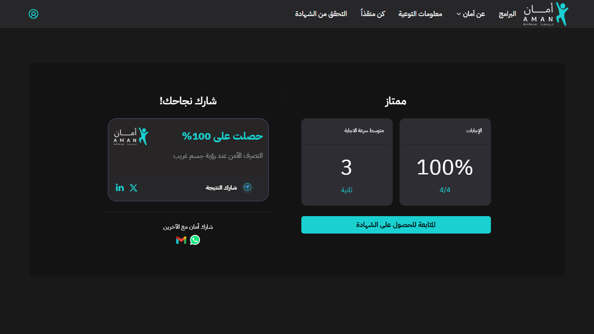

---

## 7.1 مشاركة النتيجة

بعد إنهاء البرنامج يمكن للمستخدم مشاركة النتيجة التي حصل عليها من خلال خيارات المشاركة المتاحة في الصفحة.

تتضمن صفحة النتائج بطاقة توضح:

- نسبة النتيجة.
- اسم البرنامج.
- إمكانية مشاركة الإنجاز عبر خيارات المشاركة التي توفرها المنصة.

> 💡 مشاركة النتيجة اختيارية، ويمكن للمستخدم الانتقال مباشرة إلى خطوات الحصول على الشهادة.

---

## 7.2 المتابعة للحصول على الشهادة

للبدء في إصدار شهادة الإنجاز:

1. راجع النتيجة المعروضة.
2. اضغط على زر **المتابعة للحصول على الشهادة**.
3. سيتم الانتقال إلى خطوات إصدار الشهادة.

تتكون عملية إصدار الشهادة من ثلاث مراحل:

**التقييم → إكمال البيانات → استلام الشهادة**

---

# 8. تقييم تجربة البرنامج

المرحلة الأولى للحصول على الشهادة هي **التقييم**.

تظهر صفحة بعنوان **ساعدنا على تحسين تجربتك**، وتهدف إلى جمع رأي المستخدم حول تجربة البرنامج.

### 🖼️ صورة توضيحية

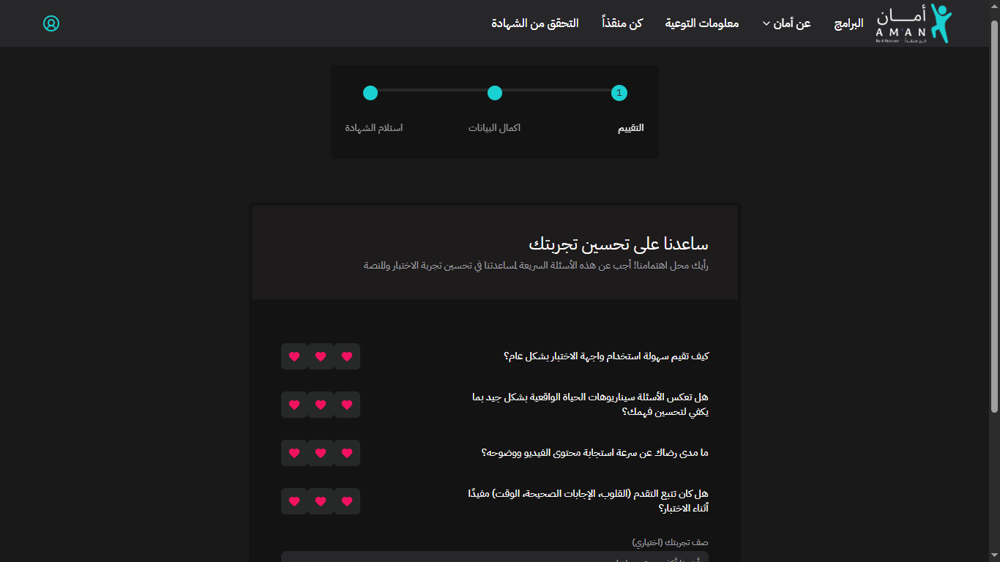

### خطوات التقييم

1. اقرأ أسئلة التقييم الظاهرة في الصفحة.
2. اختر التقييم المناسب لكل سؤال.
3. أكمل جميع عناصر التقييم المطلوبة.
4. يمكن إضافة وصف أو تعليق عن التجربة إذا كان الحقل اختياريًا.
5. أرسل التقييم للانتقال إلى الخطوة التالية.

تتناول أسئلة التقييم جوانب مثل:

- سهولة استخدام واجهة البرنامج.
- مدى وضوح المحتوى.
- الاستفادة من المعلومات التوعوية.
- سهولة متابعة التقدم أثناء تجربة التعلم.

> ℹ️ يجب إكمال مرحلة التقييم قبل الانتقال إلى الخطوة التالية من عملية الحصول على الشهادة.

---

# 9. مراجعة وإكمال بيانات الملف الشخصي

بعد الانتهاء من التقييم ينتقل المستخدم إلى المرحلة الثانية وهي **إكمال البيانات**.

تظهر هذه الصفحة لجميع المستخدمين ضمن خطوات الحصول على الشهادة، حتى إذا كانت بيانات الملف الشخصي مسجلة مسبقًا.

### 🖼️ صورة توضيحية

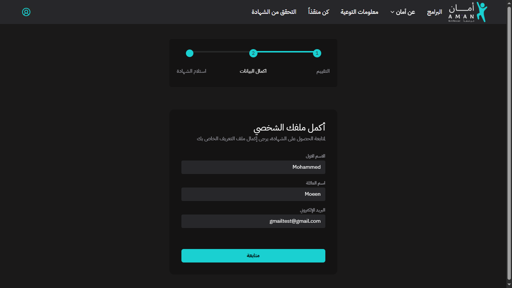

### البيانات المعروضة

تتضمن الصفحة بيانات المستخدم المطلوبة لإصدار الشهادة، مثل:

- الاسم الأول.
- اسم العائلة.
- البريد الإلكتروني.

### خطوات المتابعة

1. راجع البيانات الظاهرة في الحقول.
2. تأكد من صحة الاسم الأول واسم العائلة.
3. تأكد من صحة البريد الإلكتروني.
4. قم بتعديل أي معلومة غير صحيحة عند الحاجة.
5. اضغط على زر **متابعة**.

> ⚠️ **مهم:** يجب التأكد من كتابة الاسم بشكل صحيح، لأنه يستخدم في شهادة الإنجاز.

> 📧 يجب أيضًا التأكد من صحة البريد الإلكتروني، لأن شهادة الإنجاز يتم إرسالها إلى البريد الإلكتروني المسجل بعد إصدارها.

---

# 10. شهادة الإنجاز

بعد إكمال التقييم ومراجعة البيانات، ينتقل المستخدم إلى المرحلة الأخيرة وهي **استلام الشهادة**.

تظهر شهادة الإنجاز الخاصة بالبرنامج الذي تم إكماله.

### تتضمن الشهادة:

- اسم المستخدم.
- اسم البرنامج التعليمي.
- التقدير.
- رمز **QR Code** للتحقق من الشهادة.
- خيار تحميل الشهادة بصيغة PDF.
- خيارات مشاركة الشهادة.

### 🖼️ صورة توضيحية

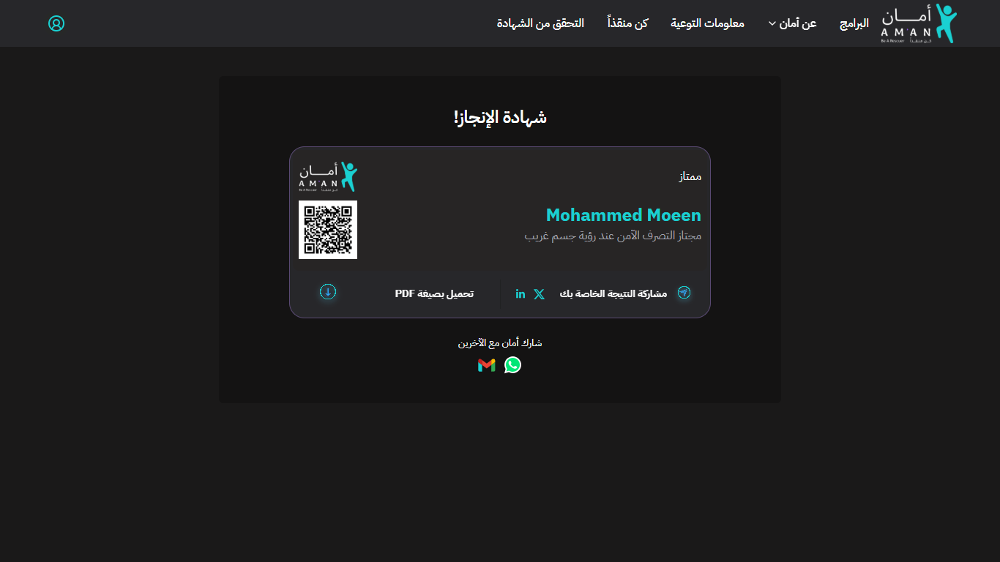

---

## 10.1 تحميل الشهادة بصيغة PDF

يمكن للمستخدم الاحتفاظ بنسخة من شهادة الإنجاز على جهازه.

### الخطوات

1. افتح صفحة **شهادة الإنجاز**.
2. اضغط على خيار **تحميل بصيغة PDF**.
3. سيتم تنزيل ملف الشهادة على الجهاز.
4. يمكن فتح الملف أو حفظه لاستخدامه لاحقًا.

---

## 10.2 مشاركة الشهادة

تتيح منصة أمان للمستخدم مشاركة إنجازه من خلال خيارات المشاركة الموجودة بجانب الشهادة.

يمكن للمستخدم اختيار إحدى وسائل المشاركة المتاحة في الواجهة ومشاركة الشهادة أو نتيجة الإنجاز مع الآخرين.

> 💡 مشاركة الشهادة اختيارية ولا تؤثر على حفظها أو صلاحيتها.

---

## 10.3 إرسال الشهادة إلى البريد الإلكتروني

بعد إصدار شهادة الإنجاز، تقوم المنصة أيضًا بإرسال الشهادة إلى **البريد الإلكتروني المسجل في بيانات المستخدم**.

لذلك يفضل التأكد من صحة البريد الإلكتروني في مرحلة **إكمال البيانات** قبل الضغط على **متابعة**.

> 📧 يمكن للمستخدم الاحتفاظ بالشهادة التي تصل إلى بريده الإلكتروني بالإضافة إلى إمكانية تحميلها مباشرة من المنصة.

---

## 10.4 رمز QR Code

تحتوي شهادة الإنجاز على **QR Code** مخصص للتحقق من الشهادة.

يساعد الرمز في الوصول إلى معلومات الشهادة والتحقق من أنها شهادة صادرة عن منصة أمان.

سيتم شرح عملية التحقق بالتفصيل في قسم **التحقق من الشهادة**.

---

## ✅ مسار الحصول على الشهادة باختصار

يمكن تلخيص العملية كاملة بالشكل التالي:

**إنهاء البرنامج**

⬇️

**عرض النتائج**

⬇️

**المتابعة للحصول على الشهادة**

⬇️

**تقييم التجربة**

⬇️

**مراجعة وإكمال بيانات الملف الشخصي**

⬇️

**إصدار شهادة الإنجاز**

⬇️

**تحميل / مشاركة / QR Code**

⬇️

**إرسال الشهادة إلى البريد الإلكتروني المسجل**

---
# 11. التحقق من الشهادة

توفر منصة أمان صفحة مخصصة للتحقق من صحة شهادات الإنجاز باستخدام **رقم الشهادة**.

يمكن لأي مستخدم الوصول إلى صفحة **التحقق من الشهادة** من القائمة العلوية.

### 🖼️ صورة توضيحية

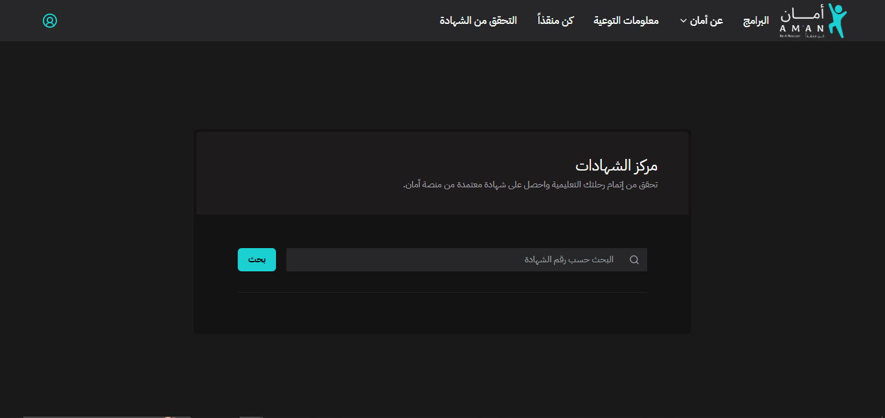

---

## 11.1 البحث باستخدام رقم الشهادة

للتحقق من شهادة:

1. افتح صفحة **التحقق من الشهادة**.
2. أدخل رقم الشهادة في مربع البحث.
3. اضغط على زر **بحث**.
4. إذا كان الرقم صحيحًا وموجودًا في النظام، ستظهر نتيجة مطابقة.
5. اضغط على النتيجة لعرض تفاصيل الشهادة.

### 🖼️ صورة توضيحية

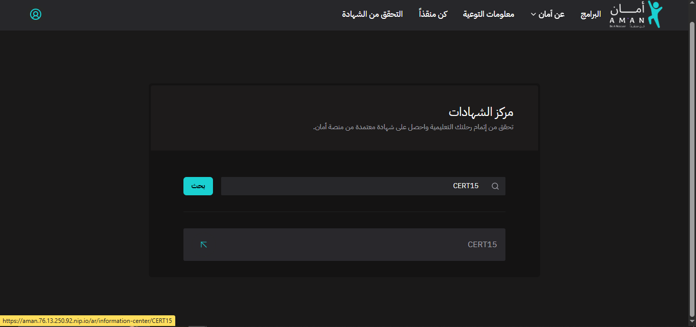

---

## 11.2 عرض تفاصيل الشهادة

بعد فتح نتيجة البحث، تظهر صفحة الشهادة المرتبطة بالرقم المدخل.

تتضمن الصفحة معلومات مثل:

- رقم الشهادة.
- اسم المستفيد.
- اسم البرنامج.
- التقدير.
- رمز **QR Code**.
- خيار تحميل الشهادة بصيغة PDF.
- خيارات مشاركة الشهادة.
- بعض معلومات النتيجة المرتبطة بالبرنامج.

### 🖼️ صورة توضيحية

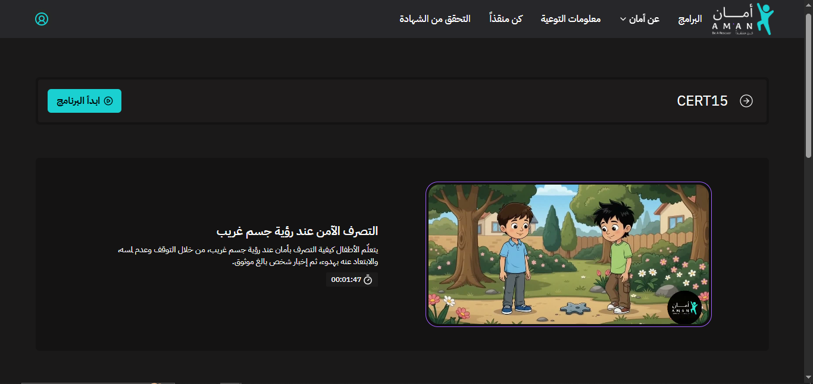

> ✅ تساعد هذه الصفحة على التأكد من أن الشهادة مرتبطة بسجل موجود داخل منصة أمان.

---

# 12. الملف الشخصي

يمكن للمستخدم الوصول إلى الملف الشخصي من خلال أيقونة المستخدم الموجودة في أعلى الصفحة.

عند الضغط على الأيقونة تظهر قائمة تحتوي على:

- **الملف الشخصي**
- **تغيير اللغة**
- **تسجيل الخروج**

### 🖼️ صورة توضيحية

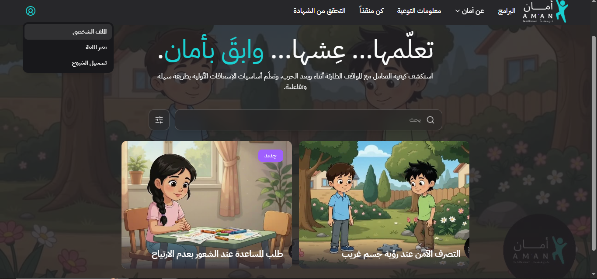

---

## 12.1 عرض الملف الشخصي

تعرض صفحة الملف الشخصي المعلومات المسجلة للمستخدم، ومن بينها:

- الاسم.
- رقم الهاتف المحمول.
- البريد الإلكتروني.
- الشهادات التي تم الحصول عليها.

### 🖼️ صورة توضيحية

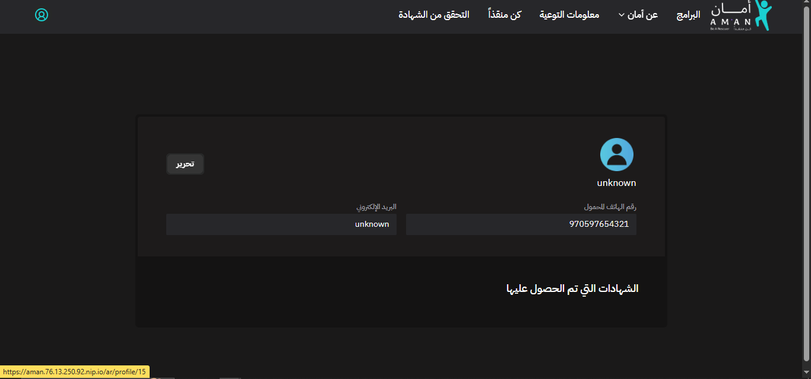

---

## 12.2 تعديل البيانات الشخصية

يمكن للمستخدم تعديل بياناته من صفحة الملف الشخصي.

### الخطوات

1. افتح **الملف الشخصي**.
2. اضغط على زر **تحرير**.
3. عدّل البيانات المطلوبة.
4. راجع المعلومات.
5. اضغط على زر **حفظ**.

تتضمن البيانات القابلة للتعديل:

- الاسم الأول.
- اسم العائلة.
- البريد الإلكتروني.
- رقم الهاتف المحمول.

### 🖼️ صورة توضيحية

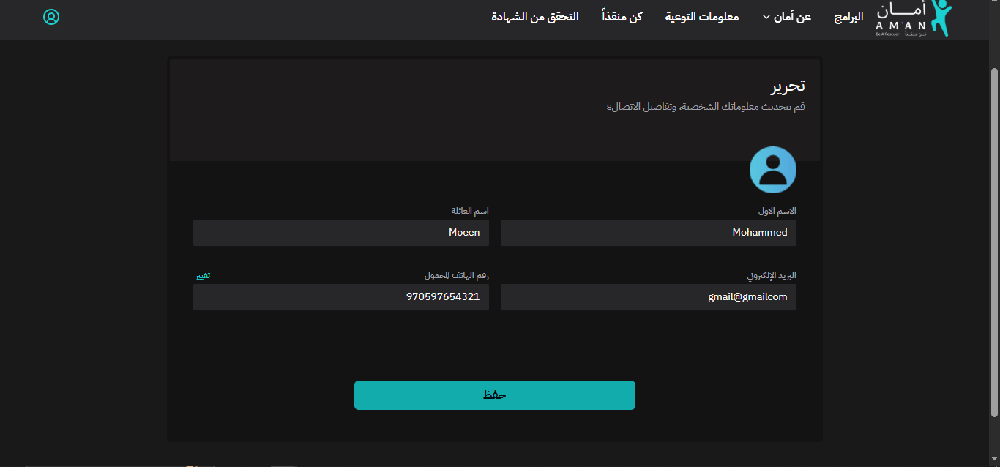

> ⚠️ يفضل التأكد من صحة الاسم والبريد الإلكتروني، لأن هذه البيانات تستخدم أيضًا في عملية إصدار شهادة الإنجاز.

---

## 12.3 تغيير اللغة

يمكن تغيير لغة المنصة في أي وقت من قائمة المستخدم.

### الخطوات

1. اضغط على أيقونة المستخدم.
2. اختر **تغيير اللغة**.
3. حدد اللغة المطلوبة.
4. سيتم عرض واجهة المنصة باللغة المختارة.

تدعم المنصة:

- العربية.
- English.

---

## 12.4 تسجيل الخروج

للخروج من الحساب:

1. اضغط على أيقونة المستخدم.
2. اختر **تسجيل الخروج**.
3. سيتم إنهاء جلسة المستخدم.

---

# 13. معلومات التوعية

يوفر قسم **معلومات التوعية** محتوى إرشاديًا يساعد المستخدم على التعرف على التصرفات الآمنة والمعلومات المرتبطة بموضوعات البرامج التعليمية.

يمكن الوصول إلى هذا القسم من القائمة العلوية للمنصة.

### 🖼️ صورة توضيحية

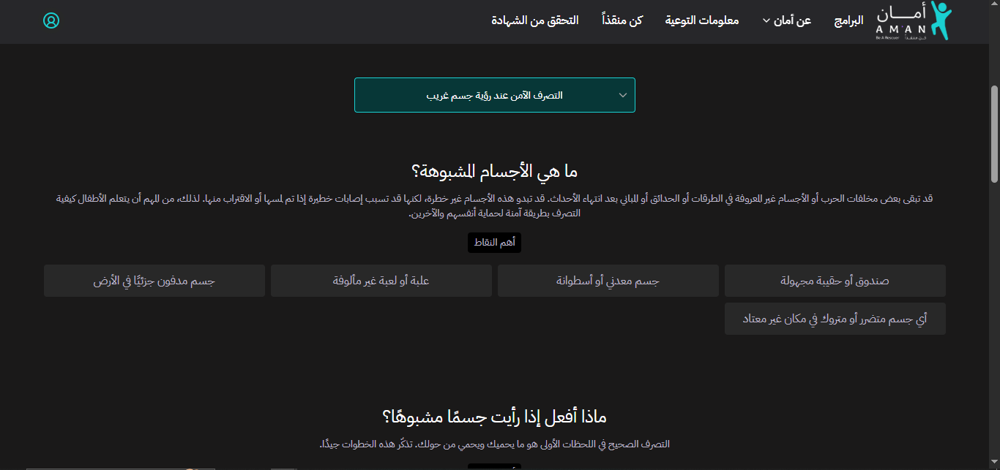

---

## 13.1 اختيار موضوع التوعية

تحتوي الصفحة على قائمة لاختيار البرنامج أو الموضوع التوعوي المطلوب.

### الخطوات

1. افتح صفحة **معلومات التوعية**.
2. اختر البرنامج أو الموضوع من القائمة المنسدلة.
3. سيتم عرض المعلومات المرتبطة بالموضوع المختار.
4. اقرأ المحتوى والإرشادات المعروضة.

---

## 13.2 قراءة المحتوى التوعوي

يتم عرض المحتوى على شكل عناوين ونقاط توضيحية تساعد المستخدم على فهم الموضوع.

قد يشمل المحتوى:

- تعريف بالموقف أو الخطر.
- أهم النقاط التي يجب الانتباه إليها.
- التصرف الصحيح في الموقف.
- نصائح وإرشادات مرتبطة بموضوع البرنامج.

### مثال

في برنامج **التصرف الآمن عند رؤية جسم غريب**، تعرض الصفحة معلومات تساعد الطفل على التعرف على الأجسام المشبوهة وكيفية التصرف بطريقة آمنة.

وفي برنامج **طلب المساعدة عند الشعور بعدم الارتياح**، تعرض الصفحة معلومات عن الشخص الموثوق وكيفية طلب المساعدة.

> 💡 يفضل قراءة معلومات التوعية بعد مشاهدة البرنامج للاستفادة من المحتوى بشكل أكبر.

---
# 14. كن منقذًا

يوفر قسم **كن منقذًا** مساحة للمستخدم لقراءة القصص المنشورة من أطفال آخرين، بالإضافة إلى إمكانية مشاركة قصة أو تجربة جديدة.

يمكن الوصول إلى القسم من القائمة العلوية في المنصة.

---

## 14.1 مشاهدة القصص المنشورة

تعرض صفحة **كن منقذًا** مجموعة من القصص التي تم نشرها واعتمادها على المنصة.

### طريقة الاستخدام

1. افتح صفحة **كن منقذًا**.
2. استعرض القصص المنشورة.
3. اختر القصة التي ترغب في قراءتها.
4. اقرأ تفاصيل القصة والمعلومات المعروضة معها.

> 💡 القصص الظاهرة في هذه الصفحة هي القصص التي تم اعتمادها للنشر على المنصة.

### 🖼️ صورة توضيحية

---

## 14.2 مشاركة قصة جديدة

يمكن للمستخدم مشاركة قصة أو تجربة جديدة من خلال نموذج إضافة القصة.

### خطوات مشاركة القصة

1. افتح صفحة **كن منقذًا**.
2. انتقل إلى نموذج مشاركة القصة.
3. أدخل البيانات المطلوبة.
4. اكتب عنوان القصة.
5. اختر البرنامج المرتبط بالقصة عند الحاجة.
6. اكتب تفاصيل القصة في الحقل المخصص.
7. راجع البيانات المدخلة.
8. وافق على الخيارات المطلوبة في النموذج.
9. اضغط على زر إرسال القصة.

### البيانات التي قد يطلبها النموذج

- الاسم الأول.
- اسم العائلة.
- العمر.
- عنوان القصة.
- البريد الإلكتروني.
- رقم الهاتف.
- البرنامج المرتبط بالقصة.
- تفاصيل القصة.
- الموافقة على عرض المعلومات المطلوبة عند نشر القصة.

### 🖼️ صورة توضيحية

---

## 14.3 متى تظهر القصة؟

بعد إرسال القصة **لا تظهر مباشرة ضمن القصص المنشورة**.

تمر القصة بمرحلة مراجعة واعتماد من إدارة المنصة، وبعد اعتمادها تصبح متاحة ضمن القصص التي يستطيع المستخدمون مشاهدتها.

> ℹ️ **ملاحظة:** النسخة الحالية لا تعرض للمستخدم رسالة أو حالة باسم **قيد المراجعة** بعد إرسال القصة.

لذلك إذا لم تظهر القصة مباشرة بعد الإرسال، فهذا لا يعني بالضرورة وجود مشكلة.

---

# 15. عن أمان والصفحات المعلوماتية

تحتوي القائمة العلوية على قسم **عن أمان** مع قائمة فرعية تتيح الوصول إلى مجموعة من الصفحات المعلوماتية والخدمية.

تشمل هذه الصفحات:

- عن أمان.
- الأسئلة الشائعة.
- تواصل معنا.
- المدونة.

---

## 15.1 عن أمان

تعرض صفحة **عن أمان** معلومات تعريفية عن المنصة وفكرتها وأهدافها.

يمكن للمستخدم زيارة هذه الصفحة للتعرف بشكل أكبر على:

- فكرة منصة أمان.
- أهداف المنصة.
- طبيعة المحتوى المقدم.
- الرسالة التوعوية للمنصة.

### 🖼️ صورة توضيحية

---

## 15.2 الأسئلة الشائعة

توفر صفحة **الأسئلة الشائعة** إجابات عن مجموعة من الأسئلة التي قد يحتاج المستخدم إلى معرفتها أثناء استخدام المنصة.

### طريقة الاستخدام

1. من القائمة العلوية افتح قائمة **عن أمان**.
2. اختر **الأسئلة الشائعة**.
3. استعرض الأسئلة المتاحة.
4. اضغط على السؤال لعرض الإجابة الخاصة به.

### 🖼️ صورة توضيحية

> 💡 ينصح بمراجعة هذه الصفحة عند وجود استفسار عام قبل استخدام نموذج التواصل.

---

## 15.3 تواصل معنا

تتيح صفحة **تواصل معنا** إرسال رسالة إلى إدارة المنصة.

يمكن استخدام الصفحة لإرسال أنواع مختلفة من الرسائل، مثل:

- استفسار.
- شكوى.
- اقتراح.

### خطوات إرسال رسالة

1. افتح قائمة **عن أمان**.
2. اختر **تواصل معنا**.
3. أدخل المعلومات المطلوبة.
4. اختر نوع الرسالة.
5. اكتب عنوان الرسالة أو الموضوع إذا كان مطلوبًا.
6. اكتب تفاصيل الرسالة.
7. راجع المعلومات المدخلة.
8. اضغط على زر الإرسال.

### 🖼️ صورة توضيحية

> ✅ حاول كتابة الرسالة بشكل واضح ومختصر حتى يسهل فهم الطلب أو الاستفسار.

---

## 15.4 المدونة

تحتوي **المدونة** على مقالات ومحتوى إضافي مرتبط بالتوعية والموضوعات التي تقدمها منصة أمان.

### طريقة الاستخدام

1. افتح قائمة **عن أمان**.
2. اختر **المدونة**.
3. استعرض المقالات المتاحة.
4. اضغط على المقال الذي ترغب في قراءته.
5. ستفتح صفحة تحتوي على تفاصيل المقال.

### 🖼️ صورة توضيحية

---

# 16. المشكلات الشائعة

فيما يلي بعض الحالات التي قد يواجهها المستخدم أثناء استخدام المنصة وطريقة التعامل معها.

---

## 16.1 عدم تحميل الفيديو

إذا لم يتم تشغيل الفيديو أو توقف التحميل:

1. تأكد من وجود اتصال بالإنترنت.
2. أعد تحميل الصفحة.
3. حاول تشغيل الفيديو مرة أخرى.
4. إذا استمرت المشكلة، حاول استخدام متصفح حديث أو جهاز آخر.

> 💡 يفضل استخدام اتصال إنترنت مستقر أثناء البرامج التعليمية.

---

## 16.2 ظهور خطأ أثناء معالجة الإجابة

قد تظهر أثناء الإجابة عن سؤال رسالة مثل:

**حدث خطأ أثناء معالجة إجابتك.**

في هذه الحالة:

1. اضغط على **موافق**.
2. تحقق من اتصال الإنترنت.
3. حاول متابعة البرنامج مرة أخرى.
4. إذا استمرت المشكلة، أعد تحميل الصفحة.

---

## 16.3 عدم ظهور الشهادة

إذا لم تظهر شهادة الإنجاز، تأكد من إكمال خطوات البرنامج بالترتيب:

1. إنهاء البرنامج والأسئلة.
2. الوصول إلى صفحة النتائج.
3. الضغط على **المتابعة للحصول على الشهادة**.
4. إكمال التقييم.
5. مراجعة البيانات الشخصية.
6. الضغط على **متابعة** حتى مرحلة إصدار الشهادة.

> 📧 تأكد أيضًا من صحة البريد الإلكتروني حتى تتمكن المنصة من إرسال الشهادة إليه.

---

## 16.4 عدم العثور على شهادة أثناء التحقق

إذا لم تظهر نتيجة بعد إدخال رقم الشهادة:

1. تأكد من كتابة رقم الشهادة بشكل صحيح.
2. تحقق من عدم وجود مسافات إضافية.
3. أعد تنفيذ عملية البحث.
4. تأكد من استخدام رقم الشهادة الصحيح الموجود في شهادة الإنجاز.

---

## 16.5 عدم ظهور القصة بعد إرسالها

القصة الجديدة لا تظهر مباشرة ضمن القصص المنشورة.

تظهر القصة بعد مراجعتها واعتمادها من إدارة المنصة.

> ℹ️ لا تعرض النسخة الحالية حالة **قيد المراجعة** للمستخدم.

---

## 16.6 مشكلة في تسجيل الدخول

إذا لم تتمكن من متابعة تسجيل الدخول:

1. تأكد من كتابة رقم الهاتف في الحقل الصحيح.
2. اختر مفتاح الدولة المناسب.
3. تأكد من اتصال الجهاز بالإنترنت.
4. حاول إعادة تحميل الصفحة.

> ℹ️ لا توجد شاشة OTP ضمن مسار الدخول في النسخة الحالية.

---

# 17. ملاحظات مهمة

للحصول على أفضل تجربة أثناء استخدام منصة أمان:

- استخدم متصفح ويب حديث.
- تأكد من توفر اتصال إنترنت مستقر.
- أدخل بياناتك الشخصية بشكل صحيح.
- تأكد من صحة البريد الإلكتروني قبل إصدار الشهادة.
- تابع الفيديو حتى النهاية وأجب عن الأسئلة التفاعلية.
- أكمل التقييم قبل الانتقال إلى إصدار الشهادة.
- احتفظ برقم الشهادة لاستخدامه في عملية التحقق.
- يمكن تحميل الشهادة بصيغة PDF ومشاركتها.
- يتم إرسال شهادة الإنجاز أيضًا إلى البريد الإلكتروني المسجل.
- القصص الجديدة تظهر للآخرين فقط بعد اعتمادها.

---

# ✅ ملخص رحلة المستخدم

يمكن تلخيص رحلة المستخدم الأساسية داخل منصة أمان بالشكل التالي:

**اختيار اللغة**

⬇️

**تسجيل الدخول برقم الهاتف**

⬇️

**استعراض البرامج**

⬇️

**اختيار وبدء برنامج**

⬇️

**مشاهدة الفيديو التفاعلي**

⬇️

**الإجابة عن الأسئلة والحصول على التغذية الراجعة**

⬇️

**متابعة القلوب والتقدم**

⬇️

**إكمال البرنامج وعرض النتائج**

⬇️

**تقييم التجربة**

⬇️

**مراجعة البيانات الشخصية**

⬇️

**الحصول على شهادة الإنجاز**

⬇️

**تحميل / مشاركة / التحقق من الشهادة**

---

# 📘 نهاية دليل المستخدم

تم إعداد هذا الدليل لتوضيح الوظائف الأساسية المتاحة للمستخدم في النسخة الحالية من منصة **أمان – AMAN**.

قد يتم تطوير أو تعديل بعض الواجهات والوظائف في الإصدارات المستقبلية من المنصة.

---

  <strong>🛡️ أمان – AMAN Platform</strong> 
  منصة توعوية تفاعلية للأطفال

